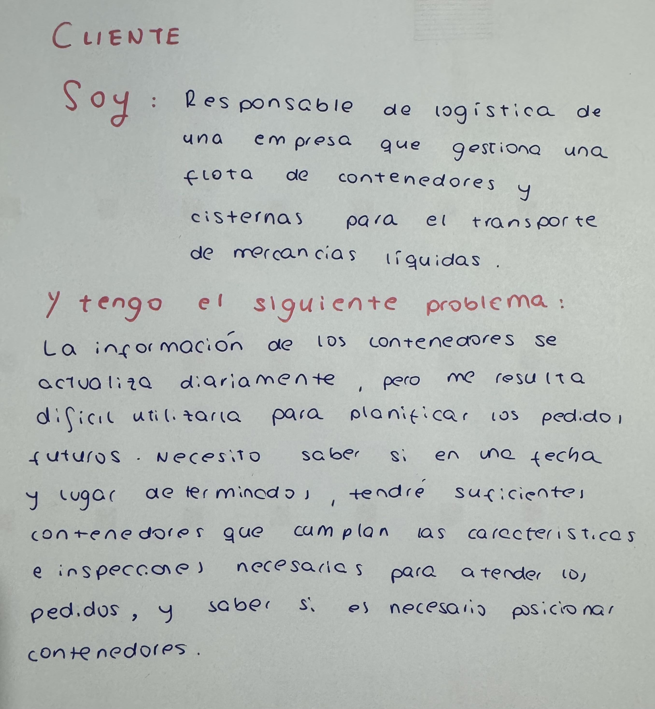

# Proyección de disponibilidad y trazabilidad histórica de Contenedores Cisterna

## Procedencia del problema
Depot Container Services, perteneciente a Euconsa y situada en Guadarranque, San Roque, desarrolla actividades relacionadas con la gestión y transporte de contenedores y cisternas utilizados para el transporte de mercancías líquidas a granel por carretera y ferrocarril. Transportan productos químicos como aceites lubricantes, disolventes, aditivos y jabones.
El área de logística gestiona una flota de 800 contenedores y cisternas. La gestión de estos contenedores requiere conocer en todo momento el estado de cada uno y tener en cuenta tanto sus características como las operaciones que tiene pendientes. 
Cada contenedor tiene unas características que condicionan las operaciones para las que puede utilizarse. Entre ellas su capacidad, su tamaño, que puede ser de 20, 25 o 30 pies en este depot y diferentes características técnicas, como si permite calentar el producto, si dispone de aislamiento, rompeolas u otros equipamientos. También es necesario conocer si el contenedor tiene al día las inspecciones periódicas como el CSC (inspección/certificación periódica exigida para determinados contenedores) o ADR (requisitos y documentación relacionados con el transporte de mercancías peligrosas por carretera).
El problema surge en la planificación diaria de la flota. La información disponible sobre los contenedores se obtiene diariamente y permite conocer la situación pero no planificar con antelación los próximos pedidos. Esto dificulta saber si en una fecha determinada habrá suficientes contenedores disponibles con las características necesarias y el lugar donde se necesitan.

## Desarrollo del problema
En la gestión de flota es necesario conocer dónde está el contenedor y en qué estado, si está cargado, vacío, sucio o limpio. Además también es necesario conocer los movimientos que ha realizado durante un período determinado para poder analizar su trazabilidad.
Sin embargo, conocer la situación diaria de la flota no es suficiente para planificar las operaciones futuras. Cuando se reciben pedidos de clientes, es necesario tener en cuenta la fecha en la que se necesitan los contenedores, el lugar donde deben estar disponibles y las características que deben cumplir.
No todos los contenedores pueden utilizarse para todos los pedidos, estos deben tener la capacidad, tamaño y características técnicas necesarias. Además de tener vigentes las inspecciones y certificaciones periódicas requeridas.
Por tanto, para planificar los próximos pedidos es necesario relacionar la información de los pedidos con la situación y características de los contenedores. Esto permite determinar si la flota será suficiente para atender a las necesidades previstas o si habrá que posicionar previamente determinados contenedores.

## Objetivo
El objetivo es analizar la información disponible sobre los contenedores, sus movimientos, características, estados y pedidos para poder planificar la disponibilidad de la flota ante las necesidades futuras de los clientes.
A partir de esta información será necesario determinar qué contenedores podrán estar disponibles para los próximos pedidos, comprobar cuáles cumplen sus requisitos técnicos y de inspección, y analizar si habrá suficientes unidades en las ubicaciones donde sean necesarias.
También será necesario analizar la información histórica de los contenedores para conocer sus períodos de actividad e inactividad y su utilización durante un período determinado.

## Datos y aproximación del problema
Para abordar el problema se dispone de información procedente de los registros utilizados en la gestión logística de la empresa. Actualmente se dispone de una exportación con información de los contenedores que incluye datos como el identificador del contenedor, si está vacío o cargado, la mercancía, el estado de planificación, la dirección y ciudad actuales, la dirección y ciudad de destino, el viaje, la fecha de finalización, el estado de integración, la fecha de última actualización y la ubicación. Además, los datos relacionados con los contenedores permiten conocer sus características y su estado. Entre ellos se encuentran información sobre su capacidad, longitud, código de cisterna y equipamiento, así como la información relacionada con sus inspecciones y certificaciones periódicas.
También se dispone de información relacionada con la actividad de los contenedores, como sus movimientos, ubicaciones, estados, pedidos asignados y fechas relevantes para determinar su disponibilidad. Por otra parte, los pedidos contienen información sobre las necesidades de los clientes, como las fechas y lugares en los que se necesitan los contenedores y las características que deben cumplir. La relación de estos datos permite estudiar la evolución de cada contenedor y determinar cuáles pueden ser adecuados para los pedidos previstos. También permite analizar si la cantidad y ubicación de los contenedores disponibles será suficiente para atender los pedidos futuros o si habrá que posicionarlos.

## Role-play

## Configuración del repositorio 
- [Configuración del entorno](docs/configuracion/configuracion.md)
